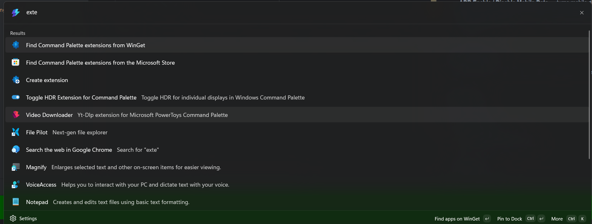
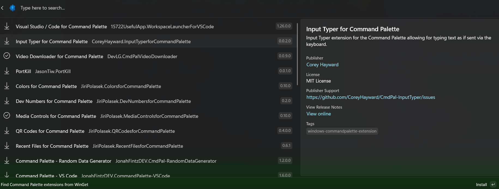

# ADB Extension for Command Palette

A Windows 11 Command Palette extension (PowerToys) for Android developers. Exposes common ADB operations directly from the command palette — no terminal needed.

## Requirements

- [PowerToys](https://github.com/microsoft/PowerToys) with Command Palette enabled
- [Android Platform Tools](https://developer.android.com/tools/releases/platform-tools) — `adb.exe` must be in your `PATH`
- A connected Android device or running emulator

## Features

### ADB App Commands

Browse all installed packages on the connected device, filtered by status (foreground, running, debuggable). Select a package to act on it:

| Action | ADB equivalent |
|---|---|
| Launch | `am start -n <launcher activity>` |
| Restart | `am force-stop` + `am start` |
| Kill Process | `am kill` |
| Force Stop | `am force-stop` |
| Clear App Data | `pm clear` |
| Clear Data & Restart | `pm clear` + `am start` |
| Open Deep Link | `am start -a android.intent.action.VIEW -d <url>` |
| Grant All Permissions | `pm grant <permission>` for each declared permission |
| Revoke All Permissions | `pm revoke <permission>` for each declared permission |
| Uninstall | `pm uninstall` |

Actions can be starred as favorites and will appear at the top of the list for that package.

### Device Commands

Available directly from the Command Palette search bar:

- **ADB Take Screenshot** — captures the screen and saves it to Pictures (or a custom folder configured in settings)
- **ADB Toggle Animations** — enables/disables window, transition, and animator duration scales
- **ADB Toggle Touch Coordinates** — shows/hides touch coordinate overlay
- **ADB Toggle Layout Bounds** — shows/hides layout bounds overlay
- **ADB Toggle Airplane Mode** — toggles airplane mode
- **ADB Enable / Disable Wi-Fi** — turns Wi-Fi on or off
- **ADB Enable / Disable Mobile Data** — turns mobile data on or off
- **ADB APK Manager** — install one or more APKs from a file picker
- **ADB Launch Deep Link** — fire an arbitrary deep link without targeting a specific package

## Installation
ADB Extension is available via command palette

## Wishlist

### App targeting
- [ ] Pull a specific shared pref file
- [ ] Dump app's database to desktop

### Device state
- [ ] Set screen timeout
- [ ] Set font size / display size
- [ ] Change locale

### Media / files
- [ ] Pull latest screenshot to clipboard
- [ ] Record screen (start/stop)

### Simulation
- [ ] Send a broadcast intent
- [ ] Simulate low battery / charging state
- [ ] Trigger doze mode
- [ ] Fake a GPS location

## License

[MIT](LICENSE)
